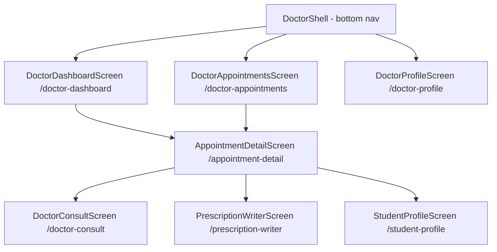

# Doctor Portal - Implementation Plan (Revised)

## Architecture Corrections

The app uses a **mixed pattern**:
- Most screens: `StatefulWidget` + `setState()` + direct Supabase calls
- Some features (profile, prescriptions, medications): Riverpod `StateNotifierProvider`
- **Doctor screens will use `setState()` + direct Supabase** to match the simpler majority pattern (like `MyAppointmentsScreen`, `ProfileScreen`, `BookAppointmentScreen`)

---

## Navigation Flow



---

## File Structure

```
lib/features/doctor/
├── data/
│   └── supabase_doctor_tables.sql
└── presentation/
    ├── doctor_shell.dart
    ├── doctor_dashboard_screen.dart      (replaces placeholder)
    ├── doctor_appointments_screen.dart
    ├── appointment_detail_screen.dart
    ├── doctor_consult_screen.dart
    ├── student_profile_screen.dart
    ├── prescription_writer_screen.dart
    └── doctor_profile_screen.dart
```

No custom models or repositories needed - query Supabase directly with `.select()` like the existing screens do.

---

## Screen Specs

### 1. DoctorShell
- Mirrors `StudentShell` exactly
- 3 bottom nav tabs: **Home** (`/doctor-dashboard`), **Appointments** (`/doctor-appointments`), **Profile** (`/doctor-profile`)
- Green accent color `0xFF059669` for active items
- No center FAB (doctors don't book appointments)

### 2. DoctorDashboardScreen
- Header card: "Welcome, Dr. [name]" + specialization
- Stats row: Today's appointments count, Pending count, Completed count
- "Today's Schedule" - list of today's appointments (max 5)
- Quick action buttons: View All Appointments, Write Prescription
- Logout button at bottom
- Data: `Supabase.from('appointments').select().eq('doctor_name', doctorName).eq('date', today)`

### 3. DoctorAppointmentsScreen
- `TabController` with 3 tabs: **Upcoming**, **Completed**, **Cancelled**
- Each card shows: student name, school, date/time, reason, status badge
- Action: tap card → `AppointmentDetailScreen`
- Pull-to-refresh
- Data: `Supabase.from('appointments').select('*, profiles!student_id(full_name, school)').eq('doctor_name', doctorName)`

### 4. AppointmentDetailScreen
- Receives `appointmentId` via `GoRouterState.extra`
- Loads full appointment + student profile
- Sections: Student info, Appointment details, Doctor notes (editable text field)
- Action buttons:
  - **Join Video Call** → `/doctor-consult?appointmentId=...`
  - **Write Prescription** → `/prescription-writer?studentId=...&appointmentId=...`
  - **View Student Profile** → `/student-profile?studentId=...`
  - **Update Status** dropdown (pending → confirmed → completed / cancelled)
- Saves doctor notes + status via `Supabase.from('appointments').update({...}).eq('id', id)`

### 5. DoctorConsultScreen
- Same Agora `_appId = '7031dcb380c84fd69ca29d062503b024'`
- Channel = `appointment_${appointmentId}` (student uses same channel from their ConsultScreen)
- Student's `ConsultScreen` needs a small update: accept optional `channelId` param from route extra
- Controls: mute, camera toggle, end call
- On end → `context.pop()`

### 6. StudentProfileScreen (Doctor View)
- Read-only display of a student's profile
- Loads from `Supabase.from('profiles').select().eq('id', studentId).single()`
- Shows: name, school, height, weight, BMI, blood type, BP, allergies
- "Past Appointments" section - list of previous visits with this doctor

### 7. PrescriptionWriterScreen
- Receives `studentId` + `appointmentId` via route extra
- Form: medication name, dosage, frequency (dropdown), duration, refills, pharmacy, instructions
- Inserts into existing `prescriptions` table
- Pre-fills `doctor_id = auth.uid()`, `prescribing_doctor = doctorName`
- Success → snackbar + `context.pop()`

### 8. DoctorProfileScreen
- Loads from `Supabase.from('profiles').select().eq('id', userId).single()`
- Displays: full name, email, specialization, license number, working hours
- Edit mode toggle (same pattern as student `ProfileScreen`)
- Saves via `Supabase.from('profiles').update({...}).eq('id', userId)`
- Logout button

---

## Database Changes

### `supabase_doctor_tables.sql`

```sql
-- Add doctor-specific columns to existing tables
ALTER TABLE appointments
  ADD COLUMN IF NOT EXISTS doctor_id UUID REFERENCES profiles(id),
  ADD COLUMN IF NOT EXISTS doctor_notes TEXT;

ALTER TABLE profiles
  ADD COLUMN IF NOT EXISTS specialization TEXT,
  ADD COLUMN IF NOT EXISTS license_number TEXT,
  ADD COLUMN IF NOT EXISTS working_hours TEXT DEFAULT '09:00 - 17:00';

-- RLS: Doctors can view appointments assigned to them by name or ID
CREATE POLICY "Doctors can view their appointments"
  ON appointments FOR SELECT
  USING (
    doctor_name = (SELECT full_name FROM profiles WHERE id = auth.uid())
    OR doctor_id = auth.uid()
  );

CREATE POLICY "Doctors can update their appointments"
  ON appointments FOR UPDATE
  USING (
    doctor_name = (SELECT full_name FROM profiles WHERE id = auth.uid())
    OR doctor_id = auth.uid()
  );

-- RLS: Doctors can view student profiles
CREATE POLICY "Doctors can view student profiles"
  ON profiles FOR SELECT
  USING (role = 'student' OR id = auth.uid());

-- RLS: Doctors can insert prescriptions
CREATE POLICY "Doctors can insert prescriptions"
  ON prescriptions FOR INSERT
  WITH CHECK (
    (SELECT role FROM profiles WHERE id = auth.uid()) = 'doctor'
  );

CREATE POLICY "Doctors can view prescriptions they wrote"
  ON prescriptions FOR SELECT
  USING (doctor_id = auth.uid() OR student_id = auth.uid());
```

---

## Router Changes (`app_router.dart`)

Replace the existing top-level `/doctor-dashboard` `GoRoute` with a `ShellRoute`:

```dart
// Add new navigator key
final _doctorShellNavigatorKey = GlobalKey<NavigatorState>();

// Replace existing GoRoute for /doctor-dashboard with:
ShellRoute(
  navigatorKey: _doctorShellNavigatorKey,
  builder: (context, state, child) => DoctorShell(child: child),
  routes: [
    GoRoute(path: '/doctor-dashboard', builder: (c, s) => const DoctorDashboardScreen()),
    GoRoute(path: '/doctor-appointments', builder: (c, s) => const DoctorAppointmentsScreen()),
    GoRoute(path: '/doctor-profile', builder: (c, s) => const DoctorProfileScreen()),
  ],
),

// Add full-screen doctor sub-routes (outside shell)
GoRoute(
  parentNavigatorKey: _rootNavigatorKey,
  path: '/appointment-detail',
  builder: (c, s) => AppointmentDetailScreen(appointment: s.extra as Map<String, dynamic>),
),
GoRoute(
  parentNavigatorKey: _rootNavigatorKey,
  path: '/doctor-consult',
  builder: (c, s) => DoctorConsultScreen(extra: s.extra as Map<String, dynamic>),
),
GoRoute(
  parentNavigatorKey: _rootNavigatorKey,
  path: '/student-profile',
  builder: (c, s) => StudentProfileScreen(extra: s.extra as Map<String, dynamic>),
),
GoRoute(
  parentNavigatorKey: _rootNavigatorKey,
  path: '/prescription-writer',
  builder: (c, s) => PrescriptionWriterScreen(extra: s.extra as Map<String, dynamic>),
),
```

Also update the redirect: `'/doctor-dashboard'` bypass must remain, and the redirect for logged-in doctors should go to `/doctor-dashboard` (already correct).

---

## Color Scheme

| Element | Color |
|---------|-------|
| Active nav / primary | `0xFF059669` (green) |
| Header gradient start | `0xFF059669` |
| Header gradient end | `0xFF0891B2` |
| Background | `0xFFF8FAFC` |
| Card | `0xFFFFFFFF` |
| Danger | `0xFFDC2626` |
| Text primary | `0xFF0F172A` |
| Text secondary | `0xFF64748B` |

---

## Implementation Order

1. `supabase_doctor_tables.sql`
2. `doctor_shell.dart`
3. `app_router.dart` updates
4. `doctor_dashboard_screen.dart`
5. `doctor_appointments_screen.dart`
6. `appointment_detail_screen.dart`
7. `doctor_consult_screen.dart`
8. `student_profile_screen.dart`
9. `prescription_writer_screen.dart`
10. `doctor_profile_screen.dart`
11. Minor update to student `ConsultScreen` to accept dynamic channel
